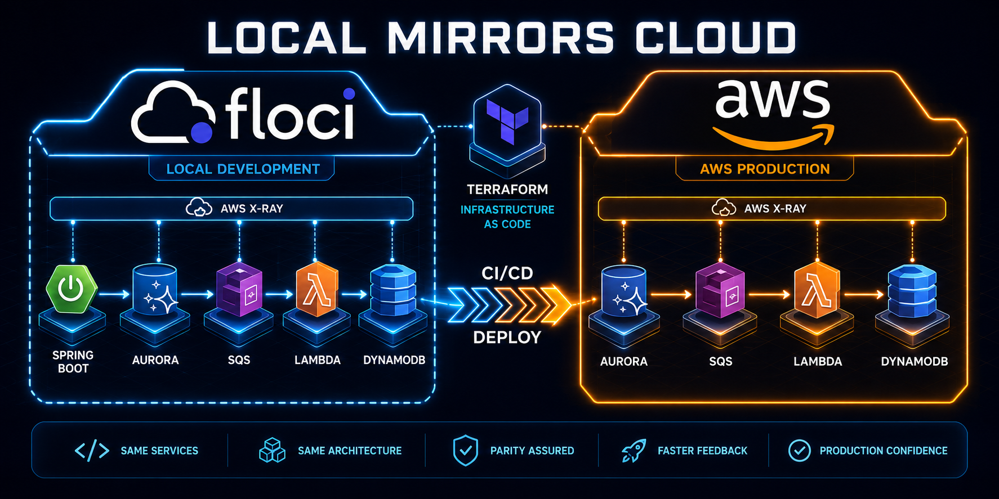

# CloudLedger

**An audit-grade, event-sourced financial ledger API built on AWS — the primitive layer that payment systems are built on top of.**



---

## What is CloudLedger?

Traditional banking systems track account state with a single row: `UPDATE accounts SET balance = 500 WHERE id = 42`. This is efficient, but it destroys history. If a bug, a race condition, or a fraudulent transfer changes that row, there is no record of what the balance was five minutes ago. An auditor asking "what was Alice's balance on March 3rd at 2:14 PM?" has no answer.

CloudLedger never updates or deletes. Every deposit, withdrawal, and transfer is written as an **immutable event** to an append-only Aurora PostgreSQL log: `MoneyDeposited`, `MoneyWithdrawn`, `TransferDebited`, `TransferCredited`. The current balance is always computed by replaying those events — exactly like a bank statement is a list of transactions, not a single number in a cell. Every state the account has ever been in is permanently reconstructable from the log.

The second problem CloudLedger addresses is **concurrent writes**. In a traditional system, two transfers hitting the same account at the same millisecond can silently destroy or create money — the second write overwrites the first without knowing it lost a race. CloudLedger uses **optimistic locking**: every write declares the account version it expects. If another write landed first, the second writer receives a `409 Conflict` and retries with the current state. Money is never lost or invented.

---

## Architecture

```
┌──────────────────────────────────────────────────────────────────────────┐
│  CloudLedger                                                              │
│                                                                           │
│  Client ──HTTP──▶ ALB ──── ① Bearer JWT ────▶ Cognito (validate)        │
│                    │                                                      │
│                    ▼                                                      │
│            ┌────────────────────────────────────────────────────────┐   │
│            │  Spring Boot 4.1 API  (ECS Fargate — public subnets)   │   │
│            │  command/query handlers  ·  idempotency filter          │   │
│            └───────────┬────────────────────────────┬───────────────┘   │
│                        │                              │                   │
│          ② JDBC events+accounts (atomic)   ③ publish to SQS after commit│
│             + write-through balance (30 min)          │                   │
│                        │                              ▼                   │
│                        ▼                    ┌────────────────────────┐   │
│             ┌───────────────────────┐       │  SQS  (KMS-encrypted)  │   │
│             │  Aurora PostgreSQL     │       │  DLQ  after 5 retries  │   │
│             │  events · accounts    │       └───────────┬────────────┘   │
│             │  outbox †             │                   │ ④ consume       │
│             └───────────────────────┘                   ▼                 │
│             ┌───────────────────────┐       ┌────────────────────────┐   │
│             │  ElastiCache Redis    │       │  projector λ            │   │
│             │  balance (30 min TTL) │       └───────────┬────────────┘   │
│             └───────────────────────┘                   │ ⑤ write         │
│                                                          ▼                 │
│                                             ┌────────────────────────┐   │
│                                             │  DynamoDB               │   │
│                                             │  STATE · BALANCE · TXNS#│   │
│                                             │  GSI: OWNER# → accounts │   │
│                                             └────────────────────────┘   │
│                                                                           │
│  † if SQS publish fails: outbox rows written (REQUIRES_NEW);             │
│    EventBridge triggers outbox-poller λ every minute to relay to SQS    │
│  ‡ EventBridge also triggers cleanup λ daily to prune, from              │
│    Aurora, expired idempotency keys + published outbox rows >24h         │
│                                                                           │
│  ── READ PATH ────────────────────────────────────────────────────────   │
│  GET /balance       Redis ──(circuit breaker / miss)──▶ DynamoDB         │
│  GET /account       DynamoDB  STATE                                       │
│  GET /transactions  DynamoDB  TXNS#  (cursor, asc / desc)                 │
│  GET /accounts      DynamoDB  GSI    (by owner_id)                        │
│                                                                           │
└──────────────────────────────────────────────────────────────────────────┘
```

**Write ordering:** within a command, the API (1) commits `events + accounts` to Aurora atomically, then (2) **write-throughs** the new balance to Redis (30-minute TTL) so the cache is warm immediately, and (3) publishes events **directly to SQS** after the Aurora commit. If SQS is unavailable, a fallback path writes outbox rows in a separate `REQUIRES_NEW` transaction; the **outbox-poller Lambda** (triggered by EventBridge Scheduler every minute) then relays those rows to SQS. Either way, the (4) **projector Lambda** consumes SQS and writes the durable `BALANCE`, `STATE`, and `TXNS#` items to DynamoDB. The write path itself **never reads** balance from the cache — sufficient-funds validation always rehydrates the aggregate from the Aurora event store.

**Read path:** `GET /balance` hits Redis first; if Redis is unavailable or the circuit breaker (Resilience4j, 50% failure threshold, 30 s open window) trips, the handler falls through to DynamoDB automatically. All other read endpoints (`GET /account`, `GET /transactions`, list by owner) go directly to DynamoDB. Aurora is never queried on the read path.

**Network topology (prod):** ECS Fargate runs in public subnets with `assign_public_ip = true` for direct ECR/SQS access. Aurora and ElastiCache run in private subnets, accessible only from the ECS and Lambda security groups. The outbox-poller Lambda runs in private subnets (Aurora access only). A **DynamoDB Gateway VPC endpoint** (free) routes DynamoDB traffic from ECS through the AWS backbone. An **SQS Interface VPC endpoint** lets the outbox-poller Lambda reach SQS from the private subnet without a NAT gateway. An **X-Ray Interface VPC endpoint** does the same for OTLP trace export, so the private-subnet Lambda can reach `xray.<region>.amazonaws.com` without internet egress (its `private_dns_enabled = true` overrides the hostname VPC-wide, so the endpoint security group also admits the ECS security group — otherwise ECS trace exports would silently time out).

---

## Key Design Decisions

| Decision | Choice | Why |
|---|---|---|
| Event store | Aurora PostgreSQL (ACID) | Optimistic lock + event insert must be one atomic transaction |
| Read model | DynamoDB + Redis + Resilience4j circuit breaker | Sub-10ms balance reads; Redis hot path (30 min TTL), automatic DynamoDB fallback if Redis degrades |
| Event fan-out | SQS-first (KMS-encrypted, DLQ after 5 retries) + transactional outbox fallback | Direct SQS publish after commit; outbox relay only if SQS is unavailable; DLQ catches poison-pill events |
| Concurrency control | Optimistic locking (version counter) | No distributed locks; contention surfaces as a 409, not silent data corruption |
| Idempotency | Per-request UUID key stored in Aurora | Safe client retries; same key always returns the same response |
| Authentication | Cognito M2M (Client Credentials / JWT) | Service-to-service API; JWT `sub` is the Cognito `client_id`, stored as `owner_id` |
| Ownership enforcement | Spring `@PreAuthorize` + `AccountSecurityService` | Declarative, single bean, works uniformly for path params and request body |
| Network | ECS in public subnets, Lambda + Aurora in private subnets, VPC endpoints | No NAT gateway; DynamoDB Gateway endpoint (free) replaces internet path; SQS Interface endpoint gives Lambda private-subnet SQS access |
| Distributed tracing | Collector-less OpenTelemetry (ADOT) → X-Ray OTLP, SigV4-signed | No sidecar — the ADOT Java agent (ECS) and ADOT layer (Lambdas) sign requests themselves; trace context flows through SQS, persisted on outbox rows for the fallback path. **Transaction Search is enabled via a CloudFormation stack wrapped in Terraform** (`aws_cloudformation_stack`) because the AWS provider has no native resource for `AWS::XRay::TransactionSearchConfig` |

---

## Quick Start (Local)

**Prerequisites:** Java 21, Docker, Terraform, Python 3.12 + `uv`

```bash
# Start local infrastructure (Floci: SQS, DynamoDB, Lambda, RDS proxy, Cognito)
docker compose up -d

# Full setup: apply Terraform (incl. Cognito), run DB migrations, build and push Lambda images
bash terraform/scripts/local-bootstrap.sh

# Get the Cognito pool ID created by Terraform
cd terraform/envs/local && terraform output -raw cognito_pool_id

# Export the JWK set URI so the API can validate tokens at startup
export COGNITO_JWK_SET_URI=http://localhost:4566/<pool_id>/.well-known/jwks.json

# Run the API
cd api && ./gradlew bootRun

# Run API tests
cd api && ./gradlew test

# Run Lambda tests
cd lambdas && uv run pytest
```

> **Flyway migrations** are disabled at Spring Boot startup in the local profile. The bootstrap script runs them via `./gradlew flywayMigrate`. To run migrations manually:
> ```bash
> cd api && ./gradlew flywayMigrate \
>   -Pflyway.url="jdbc:postgresql://localhost:7001/cloudledger" \
>   -Pflyway.user=admin \
>   -Pflyway.password=secret123
> ```

---

## Key Endpoints

> All write endpoints require:
> - `Authorization: Bearer <jwt>` — Cognito M2M token (Client Credentials grant)
> - `Idempotency-Key: <uuid-v4>` — safe retry guarantee
>
> Account mutations (deposit, withdraw, freeze, close) and transfers return `403` if the JWT `sub` does not match the account's owner. Opening an account registers the JWT `sub` as the permanent owner.

| Method | Path | Description |
|---|---|---|
| `POST` | `/v1/accounts` | Open a new account — body: `{accountId, currency}` |
| `POST` | `/v1/accounts/{accountId}/deposits` | Deposit funds — body: `{amount}` |
| `POST` | `/v1/accounts/{accountId}/withdrawals` | Withdraw funds — body: `{amount}` |
| `POST` | `/v1/transfers` | Transfer between accounts — body: `{sourceAccountId, destinationAccountId, amount, transferId}` |
| `POST` | `/v1/accounts/{accountId}/freeze` | Freeze an account |
| `POST` | `/v1/accounts/{accountId}/close` | Close an account |
| `GET` | `/v1/accounts/{accountId}` | Account state (status, currency, owner) from DynamoDB |
| `GET` | `/v1/accounts/{accountId}/balance` | Current balance — Redis hot path → DynamoDB fallback |
| `GET` | `/v1/accounts/{accountId}/transactions` | Paginated transaction history — params: `limit` (default 50, max 200), `cursor` (opaque, base64), `order` (`desc`/`asc`) |
| `GET` | `/v1/accounts` | List accounts by owner — param: `owner_id` (must match JWT `sub`) |

**Admin endpoints** are gated by a separate `api/admin` Cognito scope (a distinct M2M client — never handed to the regular read/write workload) instead of account ownership:

| Method | Path | Description |
|---|---|---|
| `POST` | `/v1/admin/projections/rebuild` | Rebuild the DynamoDB read model by re-publishing persisted events to SQS — `?account_id=` replays one aggregate, omitted replays every aggregate. Returns `202` `{job_id, status: RUNNING, total_events, ...}` |
| `GET` | `/v1/admin/projections/rebuild/{jobId}` | Poll rebuild progress — `{status: RUNNING\|DONE\|FAILED, total_events, processed_events, started_at, finished_at, error?}` |

---

## Repository Layout

```
cloud-ledger/
├── api/                        # Spring Boot 4.1 / Java 21 (ECS Fargate)
│   └── src/main/java/com/getcloudledger/api/
│       ├── account/
│       │   ├── adapter/in/web/     # REST controllers, request DTOs
│       │   ├── adapter/out/cache/  # Redis BalanceCache adapter
│       │   ├── application/        # Command + CommandHandler per use case
│       │   └── domain/             # Account aggregate, events, TransferPolicy
│       ├── admin/                  # Operator-only DynamoDB projection rebuild (api/admin scope)
│       │   ├── adapter/in/web/     # AdminController (same CQRS pattern as account/)
│       │   ├── adapter/out/persistence/  # rebuild_jobs JPA entity/repository
│       │   └── application/        # Command+Query/Handler per use case, batched event replayer
│       └── shared/                 # EventBus, CommandBus, EventStore, JPA entities, SecurityConfig
├── lambdas/                    # Python 3.12 (uv-managed)
│   ├── shared/                 # db.py, sqs.py, dynamo.py connection factories
│   ├── outbox_poller/          # polls outbox → SQS relay
│   ├── projector/              # SQS consumer → DynamoDB writer
│   └── cleanup/                # scheduled retention: prunes expired idempotency keys + old outbox rows
├── terraform/
│   ├── envs/
│   │   ├── local/              # Floci-backed local environment (local state)
│   │   └── prod/               # Production environment (S3 remote backend + S3 native lock file)
│   ├── modules/
│   │   ├── bootstrap/          # One-time: S3 state bucket (use_lockfile = true)
│   │   ├── networking/         # VPC, subnets, security groups, VPC endpoints
│   │   ├── messaging/          # KMS-encrypted SQS queue + DLQ
│   │   ├── storage/            # Aurora PostgreSQL cluster, ElastiCache, DynamoDB
│   │   ├── compute/            # ECR, IAM roles, Lambda, EventBridge Scheduler, ECS Fargate, ALB
│   │   ├── auth/               # Cognito User Pool, Resource Server, M2M app client
│   │   └── observability/      # X-Ray Transaction Search (CloudFormation) + CloudWatch ops dashboard
│   └── scripts/
│       ├── local-bootstrap.sh  # full setup from scratch
│       ├── local-destroy.sh    # full teardown
│       └── local-import.sh     # recover orphaned resources into Terraform state
├── e2e/                        # pytest: full pipeline against a running local stack
├── k6/                         # k6 load/verification suite (smoke gate, load, conflict, read)
└── README.md
```

---

## Deploying to Production

Terraform state for prod is stored remotely in S3 with native S3 locking (`use_lockfile = true`). Before the first `prod` apply, provision the backend once. The same bootstrap also creates the **GitHub Actions OIDC deploy role** used by CI/CD (see below):

```bash
# Run once with real AWS credentials — creates the S3 state bucket + OIDC deploy role
cd terraform/modules/bootstrap
terraform init && terraform apply

# Wire the OIDC role into the prod GitHub Environment (non-secret variable)
gh variable set AWS_DEPLOY_ROLE_ARN --env prod \
  --body "$(terraform output -raw github_deploy_role_arn)"
```

On the **first prod deploy**, ECR repos must exist before the Lambda and ECS resources that reference them. Use a three-step apply:

```bash
cd terraform/envs/prod
terraform init   # pulls state from S3

# Step 1 — create ECR repos only
TF_VAR_rds_password=<secret> terraform apply \
  -target=module.compute.aws_ecr_repository.api \
  -target=module.compute.aws_ecr_repository.main \
  -target=module.compute.aws_ecr_repository.projector

# Step 2 — build and push all three images
aws ecr get-login-password --region us-east-1 | \
  docker login --username AWS --password-stdin <account_id>.dkr.ecr.us-east-1.amazonaws.com

cd api && docker build -t <account_id>.dkr.ecr.us-east-1.amazonaws.com/cloudledger/api:latest . \
  && docker push <account_id>.dkr.ecr.us-east-1.amazonaws.com/cloudledger/api:latest

cd lambdas
docker build -t <account_id>.dkr.ecr.us-east-1.amazonaws.com/cloudledger/outbox-poller:latest \
  -f outbox_poller/Dockerfile . && docker push <account_id>.dkr.ecr.us-east-1.amazonaws.com/cloudledger/outbox-poller:latest
docker build -t <account_id>.dkr.ecr.us-east-1.amazonaws.com/cloudledger/projector:latest \
  -f projector/Dockerfile . && docker push <account_id>.dkr.ecr.us-east-1.amazonaws.com/cloudledger/projector:latest

# Step 3 — full apply (provisions ECS, Lambda, VPC endpoints, Cognito, ALB, Aurora, etc.)
cd terraform/envs/prod && TF_VAR_rds_password=<secret> terraform apply
```

Flyway migrations run automatically when the ECS container starts (the `prod` Spring profile enables `spring.flyway.enabled: true`). The ECS task connects to Aurora from within the VPC, so no manual migration step is needed.

After this one-time bootstrap, **subsequent deploys are automated** — push a version tag and CD does the build → ECR → rolling ECS deploy (see [CI / CD](#ci--cd-github-actions) below). To deploy by hand instead, push new images and run `terraform apply` directly — no `-target` needed.

**Distributed tracing (collector-less OpenTelemetry → X-Ray):** tracing is prod-only, gated by the `otel_traces_endpoint` compute-module variable (empty in local/Floci, which can't reach X-Ray). There is no ADOT collector or sidecar — every service signs its own OTLP requests with SigV4 and sends them straight to the X-Ray endpoint. The Spring API is instrumented by the **ADOT Java agent** baked into `api/Dockerfile` and activated in prod via `JAVA_TOOL_OPTIONS=-javaagent:...` from the ECS task def; both Python Lambdas pip-install `aws-opentelemetry-distro` and activate it via `AWS_LAMBDA_EXEC_WRAPPER=/opt/otel-instrument`. Trace context survives the SQS hop on both publish paths: on the happy path the Java agent injects `traceparent` into SQS message attributes (requires `OTEL_INSTRUMENTATION_AWS_SDK_EXPERIMENTAL_USE_PROPAGATION_FOR_MESSAGING=true`); on the outbox fallback path it can't ride through the DB in memory, so the `outbox` table carries nullable `traceparent`/`tracestate` columns stamped by `SmartEventBusRouter` and re-injected by the outbox-poller, so the projector joins the **original** trace instead of rooting a new one. Head sampling is `parentbased_traceidratio` (100% in prod, dial back once traffic makes it costly) so a trace is all-sampled or all-dropped end to end.

**X-Ray Transaction Search (CloudFormation inside Terraform):** the X-Ray OTLP endpoint requires account-level **Transaction Search** to be enabled first. The Terraform AWS provider has no native resource for `AWS::XRay::TransactionSearchConfig`, so the `observability` module wraps the AWS-documented CloudFormation in an `aws_cloudformation_stack` (the Logs resource policy + the Transaction Search config). Two caveats: Transaction Search is account-level and must be **disabled before the first apply** (CloudFormation is what creates it), and because the outbox-poller runs in a private subnet, the `networking` module adds an **X-Ray interface VPC endpoint** so it can export traces without internet egress. Verify with `aws xray get-trace-segment-destination` → `{"Destination":"CloudWatchLogs","Status":"ACTIVE"}`.

**CloudWatch operations dashboard:** the `observability` module also provisions a `cloudledger-<env>` dashboard with five widgets — transfer rate, p50/p99 API latency (ALB `TargetResponseTime`), projection lag (SQS oldest-message age + backlog), DLQ depth, and Redis cache hit rate. Transfer rate comes from a log-metric filter that counts the API's `TRANSFER_COMPLETED` log line (the API is instrumented for tracing, not custom CloudWatch metrics); the rest are native AWS service metrics.

**Getting a Cognito token (prod):**

```bash
cd terraform/envs/prod
CLIENT_ID=$(terraform output -raw cognito_client_id)
CLIENT_SECRET=$(terraform output -json cognito_client_secret | jq -r .)

TOKEN=$(curl -s -X POST \
  "https://cloudledger-prod.auth.us-east-1.amazoncognito.com/oauth2/token" \
  -H "Content-Type: application/x-www-form-urlencoded" \
  -d "grant_type=client_credentials&client_id=${CLIENT_ID}&client_secret=${CLIENT_SECRET}&scope=https://api.getcloudledger.com/write%20https://api.getcloudledger.com/read" \
  | jq -r '.access_token')
```

---

## CI / CD (GitHub Actions)

Six workflows implement the pipeline **build → unit + Testcontainers + Floci → ECR → rolling ECS deploy → k6 smoke gate**.

**CI runs on every branch.** `api-tests.yml` (unit + Testcontainers), `docker-image.yml` (Floci build + `/actuator/health`), `lambdas.yml` (pytest/ruff/mypy + Lambda smoke tests), and `terraform-validate.yml` (`fmt` + `validate`) trigger on `push` to any branch **and** on PRs to `master` — so a new feature branch gets feedback before a PR exists. A `concurrency` group cancels superseded runs. The image-push jobs are gated to `master` merges and push to the **Floci** registry (not prod).

**CD ships prod on a version tag.** `deploy-prod.yml` triggers on a semver tag:

```bash
git tag v1.2.3 && git push origin v1.2.3
```

It runs in the `prod` GitHub Environment and:

1. **Assumes AWS via GitHub OIDC** — `role-to-assume: ${{ vars.AWS_DEPLOY_ROLE_ARN }}`, no long-lived keys stored. The role is provisioned in `modules/bootstrap`, its trust scoped to exactly `repo:<owner>/<repo>:environment:prod`.
2. **Builds + pushes** the API image tagged with the immutable release tag **and** commit SHA (never `:latest` for prod).
3. **`terraform apply`** (`TF_VAR_api_image_tag`, `TF_VAR_git_commit`, `TF_VAR_rds_password`) — the task def pins `:v1.2.3`, so ECS performs a **rolling deploy** automatically. Each new task applies pending Flyway migrations on startup from inside the VPC (`spring.flyway.enabled: true` in prod).
4. **Waits for the service to stabilise**, then asserts `/actuator/info` reports the deployed tag.
5. **Runs the k6 smoke gate** (`k6/scenarios/smoke.js`) against the deployed ALB — 1 VU × 10 transfers end-to-end; a failed check or projection-lag threshold **fails the release**. The heavy load run is a *separate*, manually dispatched workflow — never a per-version gate (see [Load & Verification Testing](#load--verification-testing-k6)).

**Knowing what's running in prod** — three complementary signals: the ECS task definition pins an **immutable image tag** (`describe-task-definition` is the source of truth, and rollback = redeploy the prior revision); the task def injects **`APP_VERSION` / `GIT_COMMIT` env vars** (visible in the ECS console without decoding the image URI); and **`GET /actuator/info`** returns `app.version` + `git.commit` from those env vars, so you can ask a live instance directly.

Prerequisites: run the bootstrap above, then set `AWS_DEPLOY_ROLE_ARN` (variable) and `TF_VAR_RDS_PASSWORD` (secret) on the `prod` environment.

---

## Load & Verification Testing (k6)

The `k6/` suite is the "prove it" layer — it drives the running API and asserts the correctness and latency guarantees the design claims. It runs against local Floci or dev AWS; `BASE_URL` and Cognito credentials come from `__ENV` (defaults target local Floci). See [`k6/README.md`](k6/README.md) for run commands and the full threshold table.

**Two-tier by design.** A slow, costly load run makes a terrible merge blocker, so the suite splits cleanly:

- **Per-version smoke gate** — `k6/scenarios/smoke.js` (1 VU × 10 transfers, end-to-end) runs automatically inside `deploy-prod.yml` after the rollout, against the deployed ALB. A failed check or projection-lag threshold **fails the release**. Cheap and safe to gate on.
- **On-demand load run** — `k6-load.yml` is `workflow_dispatch`-only, guardrailed against accidents and cost (a typed `confirm: RUN`, an approval-gated `load-test` environment, a hard `timeout-minutes`, and no-overlap concurrency). It targets a **sandbox**, never literal prod — a characterization run, not a gate.

**k6 asserts what a client can observe; CloudWatch owns the rest.** k6 gates the client-side subset — transfer-write p99, projection freshness (`projection_lag`, a client-observed read-after-write measurement), check pass-rate, and error rate. The server-internal SLOs — HikariCP connection-acquire p99, DynamoDB GSI write-capacity, Redis cache-hit ratio — are read off the CloudWatch ops dashboard, not guessed at from HTTP responses. Drawing that line at the HTTP boundary is deliberate.

**Scenarios:** `smoke.js` (end-to-end write→project→read + idempotent-replay proof), `conflict.js` (the concurrent-conflict demo below — fires N simultaneous same-version debits and asserts exactly one `201`, the rest `409`, no double-spend, and the loser succeeds on retry), `load-transfers.js` (ramping to ~300 req/s), and `read-balance.js` (steady cache reads). All scenarios are declarative — auth, idempotency-key generation, and request tagging live in `k6/lib/`, not the scenario files.

---

## The Demo Scenarios

These demonstrate the system's core correctness guarantees:

**1. Idempotency demo**
Make a deposit with an `Idempotency-Key`. Replay the exact same request with the same key. The API returns the original `201` response — no second debit, no second event written to Aurora. Proves that client retries after timeouts or network drops are safe by design.

**2. Concurrent conflict demo**
Fire two transfers from the same account simultaneously. One lands first and advances the account version. The second receives `409 Conflict`. The client re-reads, retries with the updated version, and the transfer succeeds. Final balance is exactly correct — money is neither lost nor created.

**3. Async CQRS projection demo**
Issue a transfer. The command commits to Aurora, immediately write-throughs the new balance to Redis, and publishes the events directly to SQS (no outbox delay on the happy path). The projector Lambda consumes SQS within seconds and writes the durable `BALANCE` and `TXNS#` items to DynamoDB. `GET /balance` returns instantly from Redis. `GET /transactions` returns the new entry once the projector has caught up — no Aurora replay required.

**4. Read-model rebuild demo**
Delete an account's DynamoDB items outright — simulating a lost or corrupted read model. `POST /v1/admin/projections/rebuild?account_id=<id>` (an operator-only `api/admin`-scoped endpoint, separate from the regular read/write M2M client) returns `202` with a job id and replays every persisted event for that aggregate straight from Aurora back through SQS, in bounded batches so no aggregate's full history is ever held in memory at once. Poll `GET /v1/admin/projections/rebuild/{jobId}` to `DONE`, then `GET /balance` again — it matches exactly, because Aurora's append-only event log, not DynamoDB, is the source of truth. This is the same guarantee from scenario 1 taken to its logical conclusion: the read model is disposable and fully reconstructable from the log at any time.
